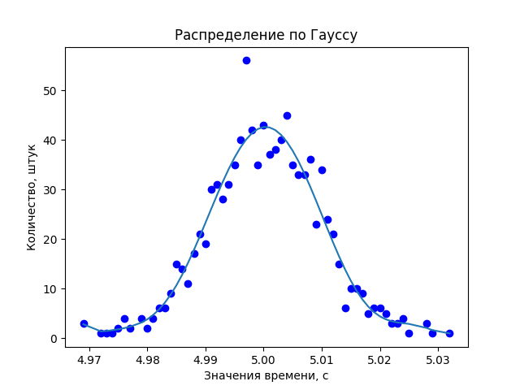

A file for plotting according to the Gaussian distribution.
An approximation curve is plotted
on the graph to visually show the graph of the Gaussian function.

Run project:
```commandline
    python main.py
    (or python3 main.py if you use Linux or OSX)
```
Install dependencies:
```commandline
    pip -r requirements.txt
    (or pip3/pip3.version if you use Linux or OSX)
```

Example of output chart:

